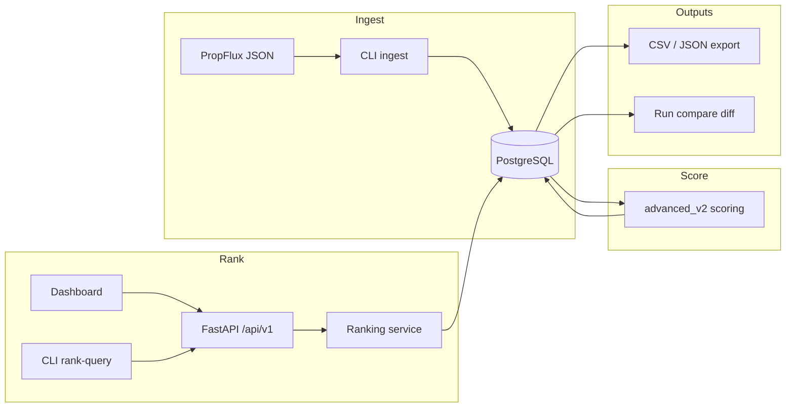

# PropSignal

**Full-stack property listing intelligence:** ingest PropFlux JSON, score listings with configurable strategies, rank and explain results, and audit runs through a CLI and operator dashboard.

Built as a portfolio project demonstrating end-to-end backend design, API contracts, data persistence, and a production-style React dashboard—not calibrated investment advice.

---

## What this demonstrates (for reviewers)

| Area | Evidence in this repo |
|------|------------------------|
| **Backend engineering** | FastAPI, SQLAlchemy, Alembic migrations, service-layer separation, structured error envelopes |
| **Data pipelines** | Partial-accept ingestion, deduplication, batch scoring, persisted ranking runs |
| **Domain modeling** | Strategy presets, weight overrides, reproducible profile backups, explainability payloads |
| **API design** | Versioned REST (`/api/v1`), ranking query + listing detail + runs export + diagnostics |
| **CLI ↔ API parity** | Same request models and services for `rank-query` and HTTP routes |
| **Frontend** | Next.js App Router dashboard: multi-tab workflows, exports, run compare diff, error UX |
| **Quality** | Ruff/Black/mypy, pytest (~90 tests), ESLint/tsc/build, GitHub Actions CI |

---

## Screenshots


---

## Architecture



**Flow:** `ingest` → `score` → `rank-query` (filters + strategy preset + result window) → persisted `run_id` → listing detail / exports / compare.

---

## Tech stack

- **Backend:** Python 3.11, FastAPI, SQLAlchemy 2, Alembic, Pydantic, Typer
- **Database:** PostgreSQL 16
- **Frontend:** Next.js 16, React 19, CSS modules
- **Tooling:** Docker Compose, GitHub Actions, Ruff, Black, mypy, pytest, ESLint

---

## Try it locally (~10 min)

**Prerequisites:** Python 3.11, Node 20, Docker Compose (recommended).

```bash
cp .env.example .env
cp backend/.env.example backend/.env
cp frontend/.env.local.example frontend/.env.local
./scripts/setup.sh
./scripts/compose-up.sh
./scripts/migrate-docker.sh
./scripts/demo-local.sh          # ingest fixture → score → rank (CLI)
```

Open [http://localhost:3000/dashboard/control](http://localhost:3000/dashboard/control) (requires `./scripts/run-backend.sh` and `./scripts/run-frontend.sh` in two terminals, or use the compose stack).

Step-by-step interviewer walkthrough: [`docs/demo.md`](docs/demo.md).

---

## Repository layout

| Path | Purpose |
|------|---------|
| `backend/` | API, services, CLI, migrations, tests |
| `frontend/` | Next.js dashboard at `/dashboard/*` |
| `config/scoring.yaml` | Scoring engine weights, flags, evaluation thresholds |
| `backend/config/scoring_profiles.yaml` | Strategy presets and profile definitions |
| `docs/` | Demo walkthrough, dashboard guide, configuration glossary, contracts |
| `scripts/` | Compose, migrate, lint, test, CLI wrappers, `demo-local.sh` |

---

## Quality gates

```bash
./scripts/lint.sh
./scripts/test.sh
```

CI on `main` / PRs: backend lint, format, mypy, migrations, pytest; frontend lint, typecheck, build, unit tests.

---

## Documentation

| Doc | Use when |
|-----|----------|
| [`docs/demo.md`](docs/demo.md) | Live demo or interview walkthrough |
| [`docs/dashboard.md`](docs/dashboard.md) | What each dashboard tab does |
| [`docs/configuration.md`](docs/configuration.md) | Env vars and domain term definitions |
| [`docs/cli-usage.md`](docs/cli-usage.md) | CLI command reference |
| [`docs/data-contract-propflux.md`](docs/data-contract-propflux.md) | Ingestion JSON schema |
| [`docs/setup-checklist.md`](docs/setup-checklist.md) | Fresh-clone verification |
| [`docs/current-project-status.md`](docs/current-project-status.md) | Built vs deferred scope |

---

## Scope and limitations (read before evaluating)

- **Heuristic scoring** — `advanced_v2` uses config-driven signals and ROI assumptions; weights are tunable but not market-calibrated in this repo.
- **Single-operator tool** — no authentication or multi-tenant isolation.
- **PropFlux JSON only** — array-root ingestion contract; no live portal scraping.
- **Reproducibility** — runs store `profile_row_id` + profile backup payload; `profile_version` in API responses is a placeholder label today.
- **Out of scope** — LLM enrichment, PDF export, hosted demo, cross-vendor entity resolution, production SLO/observability hardening.

Deeper roadmap context: [`.cursor/rules/PROJECT_NOTE.md`](.cursor/rules/PROJECT_NOTE.md).
